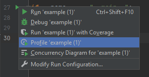

I have a simple snippet of code:

    
    import numpy as np
    
    v1 = [1, 2, 3]
    v2 = [2.4, 3, -1]
    
    
    def f1(v1, v2):  # <--- Using numpy.cross
        return list(np.cross(v1, v2))  
    
    
    def f2(v1, v2):  # <---- Using python
        a1, a2, a3 = v1
        b1, b2, b3 = v2
        return [a2 * b3 - a3 * b2, -(a1 * b3 - a3 * b1), a1 * b2 - a2 * b1]
    
    
    def x1():  
        for i in range(100000):
            v3 = f1(v1, v2)  # repeated calls for profiling usage of numpy
    
    
    def x2():
        for i in range(100000):
            v4 = f2(v1, v2)  # # repeated calls for profiling usage of python.
    
    
    if __name__ == "__main__":
        x1()
        x2()
    

By running [example.py](example.py) with profile the easy way:

the time spent is presented as follows

|name|call count| time | own time |
|---|---:|---:|---:|
|cross|100000|5669|2060|
|normalize_axis_tuple|600000|1320|901|
|moveaxis|300000|2519|830|
|built-in method numpy.array|300107|492|492|
|built-in method numpy.core._multiarray_umath.implement_array_function|400004|5827|315|
|**f1**|100000|6169|265|
|built-in method numpy.core._multiarray_umath.normalize_axis_index|900000|230|230|
|moveaxis|300000|2864|154|
|listcomp|600000|273|150|
|built-in method builtins.len|1902046|136|136|
|built-in method builtins.sorted|300001|122|122|
|method 'transpose' of 'numpy.ndarray' objects|300000|113|113|
|cross|100000|5904|64|
|**x1**|1|6229|60|
|asarray|200001|501|59|
|method 'insert' of 'list' objects|300011|53|53|
|built-in method _operator.index|600000|50|50|
|listcomp|300000|45|45|
|built-in method numpy.empty|100001|40|40|
|**f2**|100000|35|35|
|built-in method numpy.promote_types|100000|35|35|
|_moveaxis_dispatcher|300000|34|34|
|built-in method nt.stat|498|20|20|
|**x2**|1|53|18|
|built-in method _imp.create_dynamic|16|19|17|
|_cross_dispatcher|100000|13|13|
|built-in method builtins.compile|317|12|12|
|get_data|95|12|9|
|built-in method marshal.loads|95|8|8|
|method 'read' of '_io.FileIO' objects|95|3|3|
|built-in method builtins.__build_class__|201|5|3|
|built-in method _imp.exec_dynamic|16|10|2|
|find_spec|256|22|1|
|getargs|612|1|1|
|built-in method nt.listdir|12|1|1|
|built-in method _ctypes.LoadLibrary|2|1|1|
|_new_module|95|0|0|
|__init__|119|0|0|

------

The answer to the question "Is numpy really faster?" then becomes "it depends on the usage", 
and on this particular occasion it depends on how much numerical computing you're actaully 
doing as the overhead of leaving python to call numpy is far in excess to doing the 
calculation purely in python.

`numpy` needs to guess what datatype it is being given, the shape of the vectors required for calculating
the cross product, etc.

So the old ade to "specialised functions will always beat generic ones" certainly applies here.

A classic.

