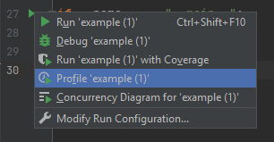

By running example.py with profile the easy way:

the time spent is presented as follows

|name|call count| time | own time |
|---|---:|---:|---:|
|cross|100000|5669|2060|
|normalize_axis_tuple|600000|1320|901|
|moveaxis|300000|2519|830|
|<built-in method numpy.array>|300107|492|492|
|<built-in method numpy.core._multiarray_umath.implement_array_function>|400004|5827|315|
|**f1**|100000|6169|265|
|<built-in method numpy.core._multiarray_umath.normalize_axis_index>|900000|230|230|
|moveaxis|300000|2864|154|
|<listcomp>|600000|273|150|
|<built-in method builtins.len>|1902046|136|136|
|<built-in method builtins.sorted>|300001|122|122|
|<method 'transpose' of 'numpy.ndarray' objects>|300000|113|113|
|cross|100000|5904|64|
|**x1**|1|6229|60|
|asarray|200001|501|59|
|<method 'insert' of 'list' objects>|300011|53|53|
|<built-in method _operator.index>|600000|50|50|
|<listcomp>|300000|45|45|
|<built-in method numpy.empty>|100001|40|40|
|**f2**|100000|35|35|
|<built-in method numpy.promote_types>|100000|35|35|
|_moveaxis_dispatcher|300000|34|34|
|<built-in method nt.stat>|498|20|20|
|**x2**|1|53|18|
|<built-in method _imp.create_dynamic>|16|19|17|
|_cross_dispatcher|100000|13|13|
|<built-in method builtins.compile>|317|12|12|
|get_data|95|12|9|
|<built-in method marshal.loads>|95|8|8|
|<method 'read' of '_io.FileIO' objects>|95|3|3|
|<built-in method builtins.__build_class__>|201|5|3|
|<built-in method _imp.exec_dynamic>|16|10|2|
|find_spec|256|22|1|
|getargs|612|1|1|
|<built-in method nt.listdir>|12|1|1|
|<built-in method _ctypes.LoadLibrary>|2|1|1|
|_new_module|95|0|0|
|__init__|119|0|0|

The answer to the question "Is numpy really faster?" then becomes "it depends". And on this particular
occasion it depends on how much numerical computing you're actaully doing as the overhead of leaving
python to call numpy is far in excess to doing the calculation purely in python.

`numpy` needs to guess what datatype it is being given, the shape of the vectors required for calculating
the cross product, etc.

So the old ade to "specialised functions will always beat generic ones" certainly applies here.
